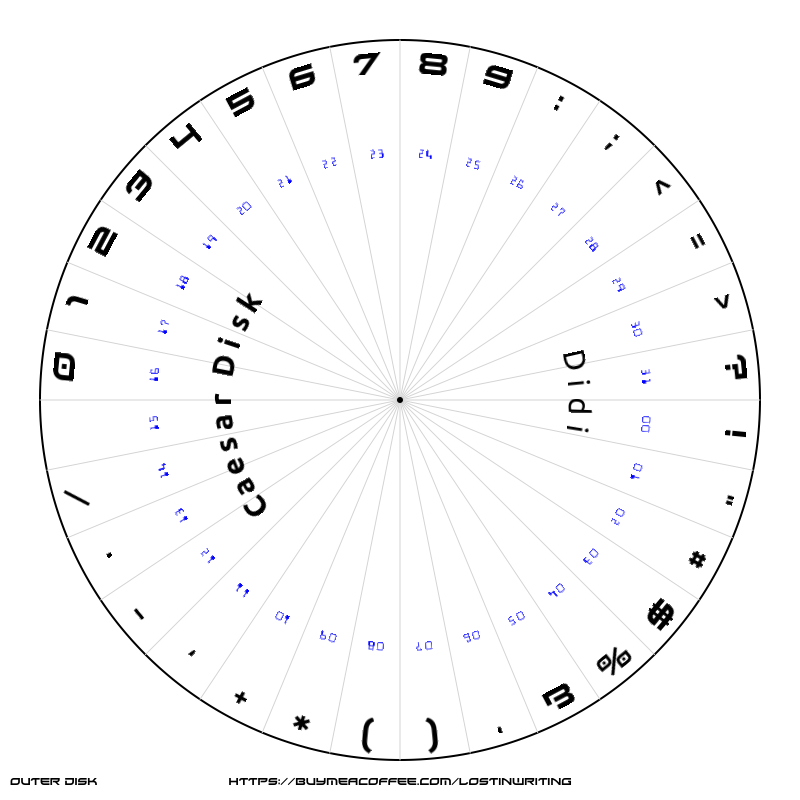
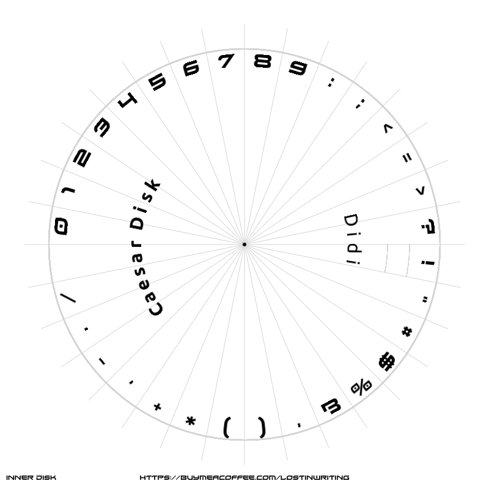

# goCaesarDisk
`Created: 16 Dic 2025`


[](https://goreportcard.com/report/github.com/lordofscripts/caesardisk)

[](https://pkg.go.dev/github.com/lordofscripts/caesardisk)
[](https://github.com/lordofscripts/caesardisk/releases/latest)
[](https://choosealicense.com/licenses/mit/)

A pure GO application to generat  two images that, put together, are
used to implement a Caesar cipher encoding/decoding disk. Simply 
overlap the *inner* disk over the *outer* disk and pin it through
the middle hole.

Unlike most prefabricated Caesar disks out there in the wild, with
my application you can use your own selection of letters. It is
thus not English centric. With the provided XIROD font, you can
use it for many languages, including those supported by my
`goCaesarX` suite: English, Spanish, Italian, Portuguese, German
and Czech. If you plan to generate your disk for Cyrillic or
Greek characters, you will need to supply a TrueType (*.ttf) font 
that supports those characters or use any of BreamCatcher or Toxicogenesis.

The *XIROD* font is a free font, also free for commercial use and 
developed by [1001 Fonts](https://www.1001fonts.com/xirod-font.html).

The *Ubuntu* fonts are free fonts, also free for commercial use and 
developed by [Dalton Maag](https://www.1001fonts.com/ubuntu-font.html)
and funded by Canonical.

The *BreamCatcher* & *Toxicogenesis* fonts are free fonts, also free 
for commercial use and developed by [RaymondLarabie](https://www.1001fonts.com/users/typodermic/).
For German (`-DE` flag) I recommend BreamCatcher which supports all
German characters.

## Usage

To generate the English disks using the default fonts:

> caesardisk

To generate discs containing the Spanish alphabet with the default
built-in fonts:

> caesardisk -title "Spanish" -ES

If you wish to override the default Alphabet letters font and use the
same for the indexes printed on the outer disk:

> caesardisk -title "Spanish" -ES -text-font xirod.regular.ttf

If you want to override both alphabet and indices fonts:

> caesardisk -title "Spanish" -ES -text-font xirod.regular.ttf -digit-font 

Each run of the application generates *two* PNG image files, one for the
outer disk (background) and one for the inner disk (foreground) which are
printed and pinned through the middle hole.





# Doing the Caesar Thing

The basis of the Caesar cipher is the single-letter key, say A..Z in the
English alphabet. To each of these letters there is a *shift-value* or
*index-value* that goes from zero (0) to the amount of letters in the
alphabet minus one. English has 26 letters (A..Z) so the key would be
between 0..25. Key 'A' corresponds to a shift of *zero* which basically
results in no encryption/decryption (try it!).

First of all you have to generate your Caesar disk as shown in the instructions
above. Make sure the alphabet contains the characters used in your language.
Most people simplify using the ASCII A..Z, but let's face it, the world is
not US-centric, there are many languages in the world. I write code with
globality in mind.

The thing is, the Caesar cipher is certainly not secure by modern standards.
It was invented in an era where most people were analphabets. But it is
still fun to use these days it. And, most people don't actually know what is
a Caesar cipher unless they read something about cryptography. Therefore,
by analogy, you could say most people these days are *cryptographically 
analphabets* and thus, the cipher is not totally useless to hide stuff
from the casual overlooker.

In any case, for those who know, if you only encode letters then your
cipher message is suceptible to attacks and could be easy to guess some
letters and thus derive the *single letter* encryption key.

How could you improve that? By also encoding digits (0..9), some symbols
and punctuation that would make it more difficult to guess. That 
technique even throws your attacker off-the-path to a good guess. Additionally,
if you also add the SPACE character to the list of encoded characters,
it will be even more difficult!

Most people would then add those digits, symbols and spaces to the 
letter set. That is fine but it makes for a very long table or big
disk! Additionally, you won't be able to preserve upper/lowercase
because you are mixing letters and non-letters in the same alphabet.

The recommended method is to use two disks:

* The primary disk for the alphabet letters (A..Z and whatever other
  special characters are used in your language like ß, Á, Ü, Ñ, etc.)
* A secondary disk for the space character, the digits and a bunch of
  useful symbols and punctuation.

Therefore, for encrypting or decrypting a Caesar-encoded message where
your set includes characters, digits, symbols, etc. as described, you
would need two disk sets:

* A disk set (inner & outer) for the **Letters**, your primary.
* A disk set (inner & outer) for the **non-letters**, your secondary.

Then you would use them to process the message character by character,
but using the appropriate *disk set* to encrypt/decrypt. There are
two methods I devised:

## Primary & Secondary with different lengths

Due to language/letter alphabet limitations, or
simply because you choose to use less symbols or punctuation
(I advise to at least keep digits and space), it is possible that
your non-letter disk may be shorter.

In that situation, for any encryption key from the Primary alphabet,
you would need to use a **derived** key for your Secondary alphabet.
That is what I do in my `goCaesarX` application suite. For that you
use the modulo operation:

If your *main/primary key* is `M` which corresponds to a *shift value*
of `12` in the English alphabet (or in the Spanish shown in the next
alternative). You will do this:

```
    Alphabet (English): ABCDEFGHIJKLMNOPQRSTUVWXYZ
    Size of Primary   : 26
    Secondary Alphabet: #$%*+,-./ 0123456789
    Size of Secondary : 20
```

In the primary you use the main key but you can't in the secondary
because it is shorter. To make it work in this situation you apply
a `modulo N` operation denoted mathematically as `% N`. Look it up
because it is beyond the scope of this tutorial!

```
    Primary Key    : M
    Primary Shift  : 12 (count starting from zero for the 1st letter)
    Secondary Shift: 12 % 20 = 12
    Plain          : AKZ$12
    Encoded        : MWL3*+
```

As long as the main shift is less than the length of the secondary
you are okay. But if you choose a main key/shift that has a shift
value beyond the size of the Secondary alphabet, you will have to
apply the *modulo* operation to get the secondary/derived key. 
For example:

```
    Primary Key    : W
    Primary Shift  : 23
    Secondary Shift: 23 % 20 = 3
    Plain          : AKZ$12
    Encoded        : DNC+45    
```

The chosen shift value corresponding to the main key corresponds to
a shift greater than the size of the secondary/auxillary alphabet.
But by applying the modulo operation using as modulo the size of 
the *Secondary/Auxillary* alphabet

## Primary & Secondary with the same length

This would be optimal because then you can use the same key
(shift value) in **both** disks. Consider this case:

```
 0        1         2         3
 01234567890123456789012345678901
 -------------------------------
 ABCDEFGHIJKLMNÑOPQRSTUVWXYZÁÉÍÓÚ
 !"#$%&'()*+,-./ 0123456789:;<=>?
 ```

The header has the shift value. Then below you find a row
with the Primary alphabet (letters only) and a row with the
non-letters, the second disk set or Secondary alphabet. Do
notice I included the SPACE between the `/` and `0`.

Because the amount of characters is the same in both, you 
can use the same *shift value/key* in both disk sets.

I did the work for the Spanish alphabet. If you have
a different alphabet, you will have to adjust the selection
of non-letters (secondary disk) so that you achive the
same lengths.

```
    Main Key       : M
    Main Shift     : 12
    Main Size      : 32
    Secondary Size : 32
    Secondary Shift: 12
    Plain          : AKZ$12
    Encoded        : MWL
```    