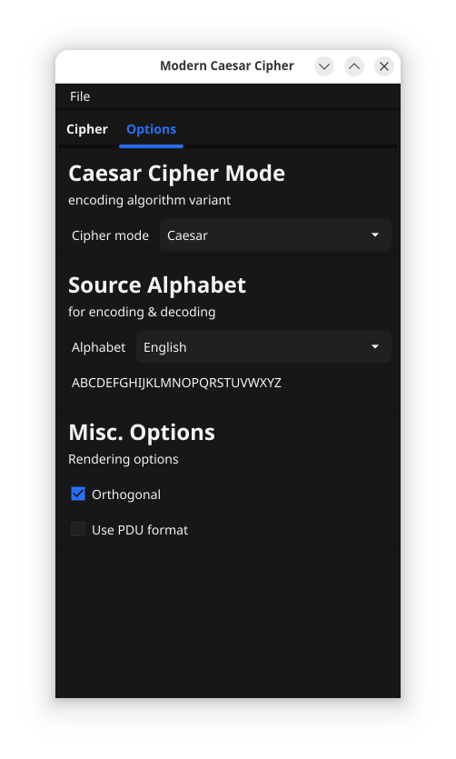
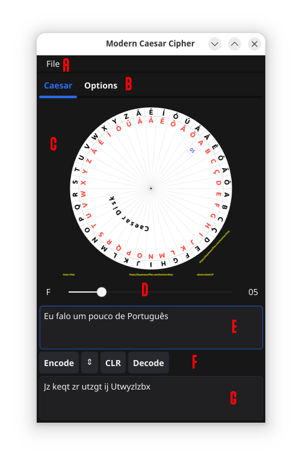

# GoCaesarDisk GUI
`Created: 27 Dec 2025`    `Updated: 30 Dec 2025`

Yes, just for fun and as an educational project, I decided to add a simple
Graphical User Interface command application to this `CaesarDisk` module.
It uses the module's *Caesar Disk/Wheel Generation* library and it does
a basic Caesar encoding (not as my full-blown Caesar).

## The Graphical User Interface

The main application window is composed of two tabs described below:

* Main application tab
* Options tab

### Options Tab

The `Options` tab allows you to configure the application for encoding
and decoding text using an enhanced Caesar cipher.

* Select the alphabet, i.e. the character set of the language in which
  you will exchange messages.
* When selected, the label below will show you the entire character set 
  for the selected alphabet/language.
* The `Orthogonal` checkbox configures the orientation of the alphabet
  letters in the Caesar wheel.
* The `Use PDU format` is normally disabled, so text is encoded and the
  output is just that. In PDU format, the encoded text if formatted
  differently.    

By default it is set to the `English` language, but there are many 
choices such as Spanish, German, Czech, Portuguese, Greek, Cyrillic
and even Runes!

### Main application (Encoding) Tab

This is where all the fun happens, encoding and decoding text. This
main tab has several sections:

* **A**: The main toolbar menu. Currently only File|Quit.
* **B**: The application tab (main & options) selector
* **C**: The dynamic Caesar encoding wheel
* **D**: The `Caesar Key` selection via the slider, its character
  and numeric shift value equivalents are shown as you slide.
* **E**: The input text, whether to *Encode* OR *Decode*
* **F**: Actions buttons to *Encode, Exchange, Clear & Decode*
* **G**: The output text after encoding or decoding.

So, it is quite simple. Based on the language (source alphabet)
you choose on the Options tab, you are able to encode or decode
messages on this main tab.

First you select the `Caesar Key` in **D**. You do that that by moving
the slider left or right, from zero (0) up to the number of 
characters in the chosen alphabet minus one. As you move the
slider, the letter key is updated on the left side, and its
numerical equivalent (`Caesar Shift`) is updated on the right.

When you finish moving the slider, you enter the text to encode
or decode in the **E** input text widget. The output of the
actions will always be shown on the **G** text widget.

Once you have text in **E**, the Encode & Decode buttons will
become activated. If you entered *Plain Text* then you should
use the **Encode** button. If on the other hand your **E** input
text is already *Caesar encoded*, you would use the **Decode**
button. The **CLR** button clears both text fields and the button
with the arrows exchanges the contents of both for your convenience.

## PDU Format

Normally the text is encoded as is, there are no extra characters.
However, if you feel playful and want to exchange better messages,
you may want to enable the `Use PDU format` option.

In PDU format, the encoded text contains "protocol units":

* The timestamp of the message in YYYYMMDDTHHMMSS format, i.e.
  `20251230T184524`
* A 64-bit checksum of the encoded message (the payload) in
  hexadecimal format, thus 16 hex characters.
* The encoded payload.

For example if we select the `English` alphabet, with `Caesar Key`
"L" which would correspond to `Caesar Shift` "11". We can try to
encode the text `Still programming for New Year` and get this:

> Detww aczrclxxtyr qzc Yph Jplc

But, if on the other hand I enabled the PDU formatting, I get:

> 20251230T2035026F5F9B17588A48E5Detww aczrclxxtyr qzc Yph Jplc

As you can see, it is prepended with the timestamp, the checksum
and the encoded message using the plain Caesar cipher.

Obviously, to decode a PDU format you also have to enable that
feature! Now click on the exchange (two arrows) button and then
click Decode.
